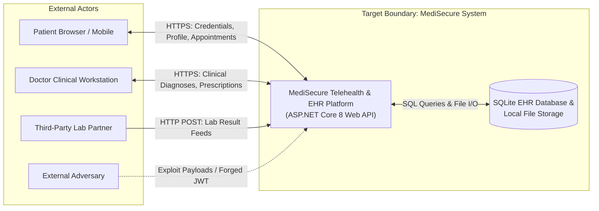

# Threat Modeling & Architectural Vulnerability Analysis Workbook
**Course**: CS 340 Secure Software Development / Application Security & Secure Software Engineering (ULACIT)  
**Deliverable**: Deliverable 1 (Week 4 Technical Report Reference Target)  
**Target System**: MediSecure Health (Telehealth & Electronic Health Records API)  
**Technology Stack**: ASP.NET Core 8 (.NET 8 C#), Entity Framework Core (SQLite), JWT Authentication, REST Web API, Swagger OpenAPI  

---

## 1. Executive Summary & System Description

### 1.1 System Purpose
**MediSecure Health** is a modern, microservice-ready Telehealth and Electronic Health Records (EHR) platform designed to provide remote medical consultations, patient diagnostic history tracking, digital prescription dispatch, and laboratory test result synchronization.

Due to the sensitive nature of healthcare operations, the system processes **Protected Health Information (PHI)** and **Personally Identifiable Information (PII)** governed by strict regulatory compliance frameworks (e.g., HIPAA, GDPR).

### 1.2 System Actors & Personas
The system decomposes into four primary human roles and two external machine integration entities:

| Actor / Entity | Classification | Description & Capabilities | Trust Level |
|:---|:---|:---|:---|
| **Patient** (`Alice`, `Bob`, `Charlie`) | Human (External) | Authenticates to view personal health history, schedule consultations, view doctor prescriptions, and manage personal profile. | Low / Semi-Trusted |
| **Doctor / Physician** (`Dr. House`, `Dr. Grey`) | Human (Internal) | Reviews patient charts, writes clinical diagnoses, issues pharmaceutical prescriptions with dosages, and completes appointments. | Medium / Trusted |
| **System Administrator** (`SysAdmin`) | Human (Privileged) | Manages clinical staff accounts, adjusts system configurations, monitors audit logs, and performs database backups. | High / Privileged |
| **Unauthenticated Guest / Attacker** | External Entity | Public network client seeking entry points, attempting credential stuffing, token forgery, or parameter tampering. | Untrusted |
| **Lab Partner Webhook** (`QuestDiagnostics`) | External Service | External diagnostic laboratory automated feed pushing lab test reports into the EHR system. | Semi-Trusted |
| **Local File System & SQLite DB** | Internal Data Store | Persistent file storage for diagnostic scans (`/uploads/`) and relational database (`medisecure.db`). | High / Internal |

---

## 2. Asset Inventory & Sensitivity Classification

| Asset ID | Asset Name | Description & Storage Location | Data Classification | Security Objectives (CIA) |
|:---|:---|:---|:---|:---|
| **AST-01** | **Patient PII & PHI** | Full name, National ID / SSN, address, phone number, clinical diagnoses, and prescriptions (`Users`, `MedicalRecords` tables). | **Restricted / Confidential** | Confidentiality, Integrity |
| **AST-02** | **Session Tokens & Keys** | JWT signing keys (`JwtSettings:SecretKey`), Bearer access tokens. | **Critical Secret** | Confidentiality, Integrity |
| **AST-03** | **Credential Hashes** | SHA-256 hashed user passwords stored in `Users.PasswordHash`. | **Confidential** | Confidentiality, Integrity |
| **AST-04** | **Diagnostic Lab Files** | Medical scans, blood panel PDFs stored in `/uploads/`. | **Confidential** | Confidentiality, Integrity |
| **AST-05** | **Consultation & Billing Records** | Scheduled appointment records, consultation fees (`Appointments` table). | **Internal Sensitive** | Integrity, Availability |
| **AST-06** | **Audit & Telemetry Logs** | System operational logs and security event records. | **Internal Operational** | Integrity, Non-Repudiation |

---

## 3. Data Flow Diagrams (DFDs) & Trust Boundaries

### 3.1 Level 0 Data Flow Diagram (Context DFD)



---

### 3.2 Level 1 Data Flow Diagram (Architectural Decomposition & Trust Boundaries)

```mermaid
graph TD
    %% External Actors
    subgraph Internet_Zone["UNTRUSTED ZONE (Public Internet)"]
        UserClient["Patient / Doctor Web Client<br/>(SPA Browser Application)"]
        LabPartner["External Lab Service<br/>(QuestDiagnostics Webhook)"]
        AttackerActor["Adversary / Threat Actor"]
    end

    %% Trust Boundary 1
    subgraph TB1["=== TRUST BOUNDARY 1: Ingress / API Boundary ==="]
        style TB1 fill:#1a233a,stroke:#3b82f6,stroke-dasharray: 5 5
        
        API_Gateway["ASP.NET Core API Ingress (Port 5000)"]
        
        subgraph Controllers["API Controllers"]
            AuthController["1.0 Auth Controller<br/>(JWT Token & Login)"]
            UsersController["2.0 Users Controller<br/>(Profile & PII)"]
            RecordsController["3.0 Records Controller<br/>(EHR & Prescriptions)"]
            ApptController["4.0 Appointments Controller<br/>(Scheduling & Fees)"]
            LabsController["5.0 Labs Controller<br/>(File Uploads)"]
            AdminController["6.0 Admin Controller<br/>(Data Export & Logs)"]
            WebhookController["7.0 Webhook Controller<br/>(Lab Ingestion)"]
        end
    end

    %% Trust Boundary 2
    subgraph TB2["=== TRUST BOUNDARY 2: Internal Services & Data Layer ==="]
        style TB2 fill:#0f172a,stroke:#10b981,stroke-dasharray: 5 5
        
        JwtService["JWT Token Validation Service<br/>(Custom Middleware)"]
        EFCore["Entity Framework Core (ORM Engine)"]
        EhrDB[("SQLite Database<br/>medisecure.db")]
        FileStorage[("Local File Storage<br/>/uploads/ Directory")]
        SysLogs[("Operational Event Logs")]
    end

    %% Data Flows
    UserClient -->|DF-01: Login Request (Email, Pass)| AuthController
    UserClient -->|DF-02: Bearer JWT + Profile Update| UsersController
    UserClient -->|DF-03: Bearer JWT + Record Query/Update| RecordsController
    UserClient -->|DF-04: Bearer JWT + Appointment Booking| ApptController
    UserClient -->|DF-05: Multipart Diagnostic File Upload| LabsController
    UserClient -->|DF-06: Admin Export Query| AdminController
    LabPartner -->|DF-07: Unauthenticated Webhook Payload| WebhookController
    AttackerActor -.->|DF-08: Spoofed JWT / IDOR Payloads| API_Gateway

    %% Internal Processing Flows
    AuthController -->|DF-09: Validate Hash & Issue Token| EhrDB
    AuthController -->|DF-10: Token Generation| JwtService
    UsersController -->|DF-11: Query/Update Users| EFCore
    RecordsController -->|DF-12: Read/Write Medical Records| EFCore
    ApptController -->|DF-13: Manage Appointments| EFCore
    LabsController -->|DF-14: Write Uploaded File| FileStorage
    AdminController -->|DF-15: Dump Entire DB| EFCore
    WebhookController -->|DF-16: Ingest Lab JSON| EFCore

    EFCore <-->|DF-17: SQL Read/Write| EhrDB
    RecordsController -.->|DF-18: Missing Audit Log on Delete| SysLogs
```

---

## 4. Attack Surface Mapping

| Interface / Entry Point | Protocol & Method | Authentication Required | Input Vectors & Payloads | Associated Threat |
|:---|:---|:---|:---|:---|
| `/api/v1/auth/register` | HTTPS POST | None (Public) | JSON: `FullName`, `Email`, `Password`, `Role`, `NationalIdOrSSN` | Registration Privilege Escalation |
| `/api/v1/auth/login` | HTTPS POST | None (Public) | JSON: `Email`, `Password` | Brute Force / DoS (TH-07) |
| `/api/v1/auth/forge-token` | HTTPS POST | None (Educational) | JSON: `UserId`, `Role`, `UseNoneAlgorithm` | JWT Token Forgery (TH-01) |
| `/api/v1/users` | HTTPS GET | Bearer JWT | Query Parameters / Headers | Excessive Data Exposure (TH-06) |
| `/api/v1/users/profile` | HTTPS PUT | Bearer JWT | JSON: `FullName`, `PhoneNumber`, `Role`, `IsAdmin` | Mass Assignment (TH-02) |
| `/api/v1/users/diagnostics` | HTTPS GET | Bearer JWT | Query: `?debug=true` | Server Secret Key Leak (TH-06) |
| `/api/v1/records/patient/{id}` | HTTPS GET | Bearer JWT | URL Parameter: `patientId` (Integer) | BOLA / IDOR (TH-05) |
| `/api/v1/records/{id}` | HTTPS PUT | Bearer JWT | JSON: `Prescription`, `Dosage`, `Diagnosis` | Prescription Tampering (TH-03) |
| `/api/v1/records/{id}` | HTTPS DELETE | Bearer JWT | URL Parameter: `id` | Repudiation / Unlogged Delete (TH-04) |
| `/api/v1/records/search` | HTTPS GET | Bearer JWT | Query: `?query=regex_pattern` | ReDoS / Resource Exhaustion (TH-07) |
| `/api/v1/admin/export-database` | HTTPS GET | Bearer JWT (Any Role) | Headers: `Authorization: Bearer <token>` | BFLA Hospital Data Dump (TH-08) |
| `/api/v1/labs/upload` | HTTPS POST | Bearer JWT | Multipart Form: `file`, `patientId`, `testName` | Path Traversal & File Upload (TH-09) |
| `/api/v1/webhooks/lab-sync` | HTTPS POST | None | JSON: `PatientId`, `TestName`, `ResultSummary` | Unauthenticated Webhook Spoofing (TH-01) |

---

## 5. STRIDE Threat Analysis Matrix

| Threat ID | STRIDE Pillar | Affected Component & Data Flow | Threat Scenario & Architectural Breakdown |
|:---|:---|:---|:---|
| **TH-01** | **Spoofing** | `AuthController.cs` / `JwtService.cs`<br/>(Flows DF-01, DF-08) | **Identity Forgery via Weak JWT**: The custom JWT validator accepts tokens signed with algorithm `"none"` and falls back to a hardcoded developer secret. An attacker can construct arbitrary JWT claims with `role: "Admin"` and impersonate hospital administrators. |
| **TH-02** | **Tampering** | `UsersController.cs`<br/>(Flow DF-02) | **Mass Assignment Privilege Escalation**: The `UpdateProfile` endpoint maps untrusted JSON input directly to the `User` model, allowing regular patients to tamper with their `Role` and `IsAdmin` flags. |
| **TH-03** | **Tampering** | `RecordsController.cs`<br/>(Flow DF-03) | **Clinical Prescription Tampering**: Medical record updates do not enforce clinical role restrictions or cryptographic integrity checksums. Any authenticated user can modify prescribed medication dosages. |
| **TH-04** | **Repudiation** | `RecordsController.cs`<br/>(Flow DF-18) | **Absence of Audit Logging for Critical Actions**: When a medical record is permanently deleted, no persistent, non-repudiable audit event is emitted. Malicious insiders can erase clinical malpractice evidence without detection. |
| **TH-05** | **Information Disclosure** | `RecordsController.cs` & `AppointmentsController.cs`<br/>(Flow DF-03) | **Broken Object Level Authorization (BOLA / IDOR)**: The endpoint `/api/v1/records/patient/{id}` fails to verify whether the requester owns the requested record or has an active doctor-patient relationship, exposing full clinical histories across patients. |
| **TH-06** | **Information Disclosure** | `UsersController.cs` & `Program.cs`<br/>(Flows DF-02, DF-11) | **Excessive Data Exposure & Debug Secret Leaks**: `/api/v1/users` returns National ID/SSN and password hashes in plaintext JSON responses. Diagnostic endpoints expose the JWT secret key and database connection string. |
| **TH-07** | **Denial of Service** | `RecordsController.cs` & `AuthController.cs`<br/>(Flows DF-01, DF-03) | **Unrestricted Resource Consumption (ReDoS & Brute Force)**: In-memory evaluation of user-supplied unanchored regular expressions without pagination or timeout exhausts server CPU; lack of login rate-limiting permits credential brute-forcing. |
| **TH-08** | **Elevation of Privilege** | `AdminController.cs`<br/>(Flow DF-06) | **Broken Function Level Authorization (BFLA)**: Administrative backup and export endpoints (`/api/v1/admin/export-database`) verify only that a token is provided, omitting role validation (`Role == "Admin"`), allowing any patient to exfiltrate the full database. |
| **TH-09** | **Tampering / Disclosure** | `LabsController.cs`<br/>(Flow DF-05) | **Unrestricted File Upload & Directory Traversal**: The lab upload endpoint fails to restrict dangerous file extensions and concatenates raw unsanitized client filenames (`../../`), allowing arbitrary file overwrite outside the storage root. |

---

## 6. Vulnerability & OWASP / CWE Correlation Matrix

| Threat ID | Threat Name | OWASP Top 10 (Web 2021) | OWASP API Security Top 10 (2023) | MITRE CWE Identifier |
|:---|:---|:---|:---|:---|
| **TH-01** | JWT Algorithm None / Secret Hardcoding | A07:2021 - Identification & Auth Failures | **API2:2023 - Broken Authentication** | CWE-287 / CWE-384 |
| **TH-02** | User Role Mass Assignment | A01:2021 - Broken Access Control | **API3:2023 - Broken Object Property Level Auth** | CWE-915 (Improper Control of Dynamically-Determined Object Attributes) |
| **TH-03** | Medical Record Parameter Tampering | A08:2021 - Software & Data Integrity Failures | **API3:2023 - Broken Object Property Level Auth** | CWE-472 (External Control of Assumed-Immutable Web Parameter) |
| **TH-04** | Missing Security Audit Trails | A09:2021 - Security Logging & Monitoring | **API10:2023 - Unsafe Consumption of APIs** | CWE-778 (Insufficient Logging) |
| **TH-05** | Cross-Patient Record IDOR | A01:2021 - Broken Access Control | **API1:2023 - Broken Object Level Authorization** | CWE-639 (Authorization Bypass Through User-Controlled Key) |
| **TH-06** | SSN & Credential Hash Exposure | A01:2021 - Broken Access Control | **API3:2023 - Excessive Data Exposure** | CWE-213 (Exposure of Sensitive Information) / CWE-209 |
| **TH-07** | ReDoS & Unthrottled Login | A04:2021 - Insecure Design | **API4:2023 - Unrestricted Resource Consumption** | CWE-400 (Uncontrolled Resource Consumption) / CWE-770 |
| **TH-08** | Non-Admin Hospital DB Export | A01:2021 - Broken Access Control | **API5:2023 - Broken Function Level Authorization** | CWE-285 (Improper Authorization) |
| **TH-09** | Lab Scan Path Traversal Upload | A01:2021 - Broken Access Control | **API8:2023 - Security Misconfiguration** | CWE-434 (Unrestricted Upload) / CWE-22 (Path Traversal) |

---

## 7. Qualitative Risk Assessment & Prioritization (DREAD & Likelihood vs. Impact)

### 7.1 Likelihood vs. Impact Scoring Matrix
*Likelihood (1–5): 1=Rare, 2=Unlikely, 3=Moderate, 4=Likely, 5=Almost Certain*  
*Impact (1–5): 1=Insignificant, 2=Minor, 3=Moderate, 4=Major, 5=Catastrophic*

| Threat ID | Threat Description | Likelihood (1-5) | Impact (1-5) | Risk Score (LxI) | Risk Level |
|:---|:---|:---:|:---:|:---:|:---:|
| **TH-01** | JWT Forgery & Identity Spoofing | 4 | 5 | 20 | **CRITICAL** |
| **TH-02** | Mass Assignment Role Escalation to Admin | 4 | 5 | 20 | **CRITICAL** |
| **TH-05** | BOLA / IDOR Cross-Patient Clinical Record Leak | 5 | 5 | 25 | **CRITICAL** |
| **TH-08** | BFLA Full Hospital Database Dump | 4 | 5 | 20 | **CRITICAL** |
| **TH-03** | Clinical Prescription & Dosage Modification | 3 | 5 | 15 | **HIGH** |
| **TH-06** | Excessive Data Exposure (SSN & Hashes Leaked) | 4 | 4 | 16 | **HIGH** |
| **TH-04** | Missing Audit Trail for Record Deletion | 4 | 4 | 16 | **HIGH** |
| **TH-09** | Insecure File Upload & Path Traversal | 3 | 4 | 12 | **HIGH** |
| **TH-07** | Resource Consumption (ReDoS & Brute Force) | 4 | 3 | 12 | **MEDIUM** |

---

### 7.2 DREAD Model Evaluation (0–10 Scale)

| Threat ID | Damage (D) | Reproducibility (R) | Exploitability (E) | Affected Users (A) | Discoverability (D) | DREAD Average | Priority |
|:---|:---:|:---:|:---:|:---:|:---:|:---:|:---:|
| **TH-05 (IDOR)** | 10 | 10 | 10 | 10 | 9 | **9.8 / 10** | **P1 (Urgent)** |
| **TH-01 (JWT Spoof)** | 10 | 10 | 9 | 10 | 9 | **9.6 / 10** | **P1 (Urgent)** |
| **TH-08 (BFLA)** | 10 | 10 | 9 | 10 | 8 | **9.4 / 10** | **P1 (Urgent)** |
| **TH-02 (Mass Assign)** | 9 | 10 | 9 | 10 | 8 | **9.2 / 10** | **P1 (Urgent)** |
| **TH-03 (Rx Tamper)** | 10 | 9 | 8 | 7 | 8 | **8.4 / 10** | **P2 (High)** |
| **TH-06 (PII Exposure)**| 8 | 10 | 9 | 10 | 9 | **9.2 / 10** | **P2 (High)** |
| **TH-04 (Repudiation)** | 8 | 8 | 8 | 8 | 7 | **7.8 / 10** | **P2 (High)** |
| **TH-09 (Upload)** | 8 | 9 | 7 | 6 | 8 | **7.6 / 10** | **P3 (Medium)** |
| **TH-07 (DoS)** | 7 | 8 | 8 | 8 | 7 | **7.6 / 10** | **P3 (Medium)** |

---

## 8. Mitigation Strategies & Security Controls (Defense-in-Depth)

```mermaid
graph LR
    subgraph Preventative["1. Preventative Controls"]
        P1["Strict DTO Binding & Whitelisting"]
        P2["Object Ownership Verification Checks"]
        P3["Standardized JWT Bearer Validation (Strict HMAC-SHA256)"]
        P4["Role-Based Policy Enforcement ([Authorize(Roles='Admin')])"]
    end

    subgraph Detective["2. Detective Controls"]
        D1["Structured Security Audit Logging (Serilog / EF Interceptors)"]
        D2["Real-time Telemetry & Anomaly Alerts"]
        D3["WAF & Rate Limiting Middleware"]
    end

    subgraph Corrective["3. Corrective Controls"]
        C1["Token Blacklist / Distributed Redis Revocation Store"]
        C2["Automated Key Rotation via Azure Key Vault / AWS Secrets Mgr"]
        C3["Database Point-In-Time Backup & Rollback Procedures"]
    end

    Preventative --> Detective --> Corrective
```



### 8.1 Concrete Engineering Mitigations by Threat

#### Mitigation for TH-01 (Spoofing / JWT Forgery)
- **Control**: Reject the `none` algorithm unconditionally in `JwtSecurityTokenHandler`.
- **Implementation**: Enforce `ValidateIssuerSigningKey = true`, `RequireSignedTokens = true`, and store signing keys in secure secret management (Azure Key Vault or Environment Secrets), never in source code.
- **Code Pattern**:
  ```csharp
  builder.Services.AddAuthentication(JwtBearerDefaults.AuthenticationScheme)
      .AddJwtBearer(options => {
          options.TokenValidationParameters = new TokenValidationParameters {
              ValidateIssuer = true,
              ValidateAudience = true,
              ValidateIssuerSigningKey = true,
              ValidAlgorithms = new[] { SecurityAlgorithms.HmacSha256 },
              IssuerSigningKey = new SymmetricSecurityKey(Encoding.UTF8.GetBytes(builder.Configuration["Jwt:Secret"]!))
          };
      });
  ```

#### Mitigation for TH-02 (Tampering / Mass Assignment)
- **Control**: Implement strict Input Transfer Objects (DTOs) omitting sensitive properties (`Role`, `IsAdmin`).
- **Implementation**: Never bind client payloads directly to database entities.
- **Code Pattern**:
  ```csharp
  // Safe DTO omitting internal flags
  public class SafeUpdateProfileDto {
      [Required, MaxLength(100)] public string FullName { get; set; } = string.Empty;
      [Phone] public string PhoneNumber { get; set; } = string.Empty;
      [MaxLength(200)] public string Address { get; set; } = string.Empty;
  }
  ```

#### Mitigation for TH-05 (Information Disclosure / BOLA IDOR)
- **Control**: Server-side contextual authorization checking caller identity against resource ownership.
- **Implementation**: Validate that the requesting user's `NameIdentifier` matches `patientId`, or verify that the user possesses a verified `Doctor` or `Admin` role.
- **Code Pattern**:
  ```csharp
  [HttpGet("patient/{patientId}")]
  [Authorize]
  public async Task<IActionResult> GetPatientRecords(int patientId) {
      var currentUserId = int.Parse(User.FindFirstValue(ClaimTypes.NameIdentifier)!);
      var isDoctorOrAdmin = User.IsInRole("Doctor") || User.IsInRole("Admin");

      if (currentUserId != patientId && !isDoctorOrAdmin) {
          return Forbid(); // 403 Forbidden
      }
      var records = await _context.MedicalRecords.Where(r => r.PatientId == patientId).ToListAsync();
      return Ok(records);
  }
  ```

#### Mitigation for TH-08 (Elevation of Privilege / BFLA)
- **Control**: Mandatory attribute-based access control on administrative controller endpoints.
- **Implementation**: Add `[Authorize(Roles = "Admin")]` to `AdminController` endpoints.

#### Mitigation for TH-04 (Repudiation / Missing Audit Trails)
- **Control**: Implement an append-only, tamper-evident audit logging table (`SecurityAuditEvents`) recording `Timestamp`, `ActorUserId`, `ActionType`, `TargetResourceId`, `IPAddress`, and `PreviousStateHash`.

---

## 9. Deliverable 1 Report Structure Checklist
Students using this codebase to compile their Week 4 report can follow this section structure:
1. **Title Page & Executive Summary** (Course, Term, Target Name, Architecture Synopsis).
2. **System Decomposition & Asset Inventory** (Actors table, Asset classification table).
3. **Data Flow Diagrams** (Context Level 0 and Level 1 DFDs with Trust Boundaries highlighted).
4. **Attack Surface Mapping** (Full endpoint inventory with protocol, methods, and input parameters).
5. **STRIDE Threat Modeling** (Detailed scenarios for all 6 STRIDE categories).
6. **Vulnerability & OWASP / CWE Mapping Matrix** (Aligning threats to OWASP API 2023 & CWEs).
7. **Qualitative Risk Prioritization** (DREAD and Likelihood vs. Impact scoring tables).
8. **Actionable Mitigation Controls** (Defense-in-depth engineering recommendations and code patches).
